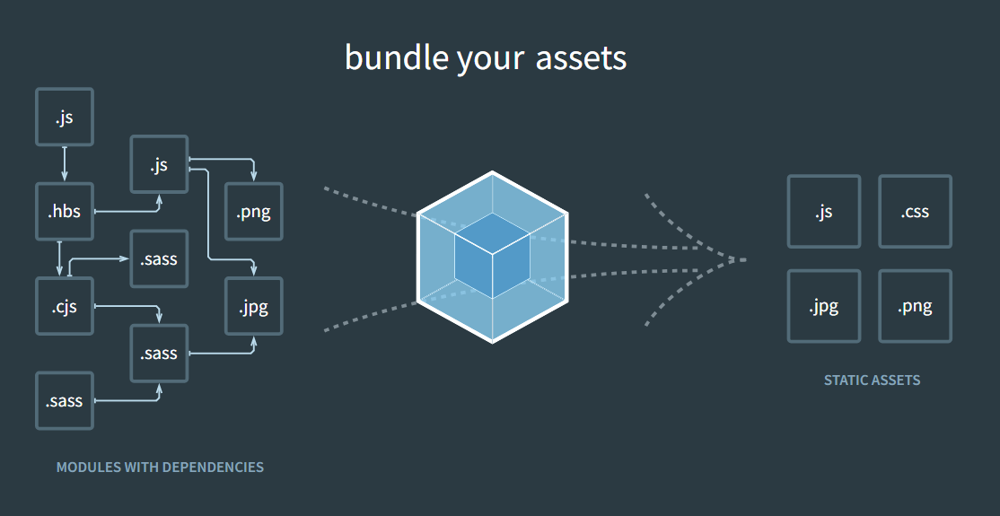

# Webpack Basic


**Відео:** 23.10.2025

[](https://youtu.be/1C_wyTtBwl4?si=wEUWenLbNp8A2cqV)


**Pесурси:**

[https://webpack.js.org/](https://webpack.js.org/) - це офіційна документація Webpack, одного з найпопулярніших інструментів для збірки JavaScript-проєктів. Його головне завдання — взяти всі файли твого проєкту (JS, CSS, зображення, шрифти, SCSS тощо) і об’єднати їх у кілька оптимізованих файлів, готових для продакшну (production).

[https://webpack.js.org/plugins/html-webpack-plugin/](https://webpack.js.org/plugins/html-webpack-plugin/) - це плагін для Webpack, який створює HTML-файл автоматично (або бере готовий шаблон і вставляє у нього зібрані скрипти, стилі тощо). Замість того, щоб вручну писати `<script src="main.7d9a23f4c2e8a.js"></script>` — він робить це сам.

[https://bundlephobia.com/](https://bundlephobia.com/) - це безкоштовний онлайн-інструмент, який дозволяє оцінити "вартість" (переважно в плані розміру і продуктивності) підключення пакету з npm до вашого JavaScript-проекту. Дозволяє дізнатись, який розмір має npm-пакет при додаванні до збірки: зокрема стислений (minified) і gzipped розмір. Показує складання модуля: скільки зовнішніх залежностей, кірпичі (chunks) або «exports». Має можливість «сканування» файлу package.json (бета) для аналізу послідовно декількох залежностей.

[https://babeljs.io/](https://babeljs.io/) - це компілятор (або точніше транс­компілятор) для JavaScript, який дозволяє використовувати нові можливості мови вже сьогодні, перетворюючи їх у код, сумісний зі старішими середовищами виконання (наприклад, старими браузерами).

[https://momentjs.com/](https://momentjs.com/) - це бібліотека JavaScript для роботи з датами і часом: вона дозволяє парсити, перевіряти валідність, маніпулювати (додавати/віднімати час) і форматувати дати/час у зручному вигляді. Вона працює як у браузері, так і на Node.js.

## Що таке Webpack?

> **Webpack** - це бандлер, потужний інструмент для збирання модулів JavaScript, який дозволяє нам збирати та оптимізувати ресурси та активи веб-проєкту, такі як JavaScript, CSS та зображення. Він аналізує залежності між модулями, перетворює їх за допомогою лоадерів та плагінів, і генерує один або кілька пакетів, які можна легко використовувати у веб-додатках. Ми використовуємо Webpack для оптимізації процесу розробки та забезпечення високої продуктивності кінцевого продукту.

**Як Webpack працює з активами проекту?**



На зображенні демонструється процес роботи Webpack: він бере різноманітні типи файлів та модулів з їх залежностями (JavaScript, SASS, зображення тощо), створює з них граф залежностей, а потім "упаковує" ці ресурси в оптимізовані статичні активи (JavaScript, CSS, зображення), які легко інтегрувати в веб-додатки.

**Gulp vs Webpack**

**Gulp і Webpack** - це інструменти, які використовуються в процесі розробки веб-додатків, але вони служать трохи різним цілям і працюють за різними принципами.

> **Gulp** - це інструмент автоматизації завдань, який дозволяє нам легко виконувати різноманітні задачі, такі як мініфікація CSS та JavaScript файлів, оптимізація зображень, компіляція Sass або Less у CSS тощо. Він використовує систему потоків Node.js, що дозволяє ефективно обробляти файли та дані.

**Webpack**, з іншого боку, є модульним бандлером, який зосереджений на збиранні JavaScript модулів, але також може обробляти інші типи файлів за допомогою лоадерів. Webpack аналізує залежності між модулями, оптимізує їх та генерує один або кілька пакетів, які можна легко інтегрувати в веб-додатки.

Отже, основна різниця між Gulp і Webpack полягає в їхньому призначенні: Gulp використовується для автоматизації різноманітних завдань розробки, тоді як Webpack спрямований на оптимізацію та збирання модулів і ресурсів проєкту. Обидва інструменти можуть використовуватися разом для досягнення максимальної ефективності в процесі розробки веб-додатків.

**Встановлення webpack та webpack-cli**

```cmd
npm i -D webpack webpack-cli
```

Ця команда використовується для встановлення `webpack` та `webpack-cli` як залежності розробки у вашому проєкті за допомогою npm, менеджера пакетів. Параметр `-D` (або `--save-dev`) вказує на те, що ці пакети мають бути додані до розділу `devDependencies` у вашому файлі `package.json`, оскільки вони зазвичай потрібні тільки для процесу розробки, а не для виконання самого додатку у продакшені.

- `webpack`: Основний пакет Webpack, який використовується для збірки модулів і активів.
- `webpack-cli`: Командно-рядковий інтерфейс для Webpack, що дозволяє запускати команди та керувати конфігураціями.

## Базовий конфіг

Базовий конфігураційний файл Webpack визначає мінімальний набір параметрів, необхідних для збирання проєкту. Ми описуємо точку входу (entry), де Webpack почне аналіз залежностей, та вихідний файл (output), куди буде скомпільовано весь зібраний JavaScript код.

У нашому прикладі, ми встановлюємо `entry` як `./src/index.js`, що є головним файлом нашого додатку. Webpack аналізує цей файл, визначає всі імпортовані залежності та об'єднує їх.

Для `output`, ми вказуємо шлях і назву файла, де буде збережено результат. У цьому випадку, скомпільований файл буде називатися `bundle.js` і зберігатися у папці `dist`. Шлях до папки визначається за допомогою модуля `path` з Node.js, що гарантує коректність шляху на різних операційних системах.

```js
const path = require('path');

module.exports = {
  entry: './src/index.js',
  output: {
    path: path.resolve(__dirname, 'dist'),
    filename: 'bundle.js',
  },
};
```

Для використання згенерованого `bundle.js` його потрібно підключити у наш HTML файл:

```html
<!DOCTYPE html>
<html>
<head>
  ...
</head>
<body>
  ...
  <script src="dist/bundle.js"></script>
</body>
</html>
```

Цей HTML файл можна розмістити в корені проєкту або в іншому місці, важливо лише правильно вказати шлях до `bundle.js` у тегу `<script>`. Таким чином, браузер зможе завантажити та виконати скомпільований JavaScript-код, який містить усю логіку вашого веб-додатку.

**Збірка проєкту**

Наступна команда запускає збірку проєкту за допомогою Webpack, використовуючи налаштування з файлу webpack.config.js:

```cmd
npx webpack --config webpack.config.js
```

**Встановлює режим збірки проєкту**

Властивість `mode: 'development'` у нашому конфігураційному файлі Webpack встановлює режим збірки проєкту у розробницький. Це означає, що процес збирання буде оптимізований для швидкості та зручності розробки, не зосереджуючись на оптимізації для продакшену. Такий режим зазвичай включає корисні інструменти для дебагінгу, такі як source maps, і не мініфікує вихідний код, що робить його легшим для читання та відладки.

```js
const path = require('path')

module.exports = {
  mode: 'development',
  entry: './src/index.js',
  output: {
    filename: 'bundle.js',
    path: path.resolve(__dirname, 'dist')
  }
}
```

**Імпорти / експорти класів**

Тепер у нашому коді ми можемо використовувати `export default` для експорту класу Post, що дозволяє імпортувати його в інших файлах з використанням синтаксису `import`.

```js
// post.js
export default class Post {}

// index.js
import Post from './post'
```

Замість підключення декількох скриптів в HTML, Webpack дозволяє нам об'єднати весь JavaScript у один `bundle.js`, який ми підключаємо одним тегом `<script>`.

```html
<!-- замість двох файлів -->
<!-- <script src="post.js"></script> -->
<!-- <script src="index.js"></script> -->

<!-- можемо використовувати один файл, зібраний за допомогою вебпак -->
<script src="bundle.js"></script>
```

## Робота з файлами

**Декілька точок входу**

У нашому конфігураційному файлі Webpack ми визначили декілька точок входу, що дозволяє нам створювати різні бандли для різних частин нашого додатку. У цьому випадку, `main` і `stat` є ключами для двох різних точок входу, які вказують на файл `index.js` та `statistics.js` відповідно. За допомогою патерну `[name]` у властивості `filename`, Webpack генерує два окремі бандли з назвами `main.bundle.js` та `stat.bundle.js`. Ці бандли будуть розміщені у папці `dist`, згідно з вказаним шляхом в `path`.

```js
const path = require('path')

module.exports = {
  mode: 'development',
  entry: {
    main: './src/index.js',
    stat: './src/statistics.js'
  },
  output: {
    filename: '[name].bundle.js',
    path: path.resolve(__dirname, 'dist')
  }
}
```
```html
<!doctype html>
<html lang="en">

<head>
  <meta charset="UTF-8">
  <meta name="viewport"
    content="width=device-width, user-scalable=no, initial-scale=1.0">
  <meta http-equiv="X-UA-Compatible" content="ie=edge">
  <title>Document</title>
  <script src="stat.bundle.js"></script>
</head>

<body>

  <div class="container">
    <h1>Webpack training</h1>
  </div>

  <script src="main.bundle.js"></script>
</body>

</html>
```

**Хешування імен файлів**

Хешування імен файлів у Webpack використовується для оптимізації кешування браузера, дозволяючи ефективніше управляти завантаженням статичних ресурсів. Це гарантує, що користувач завантажує нову версію файлу лише тоді, коли його вміст дійсно змінився.

```js
const path = require('path')

module.exports = {
  mode: 'development',
  entry: {
    main: './src/index.js',
    stat: './src/statistics.js'
  },
  output: {
    filename: '[name].[contenthash].js',
    path: path.resolve(__dirname, 'dist')
  }
}
```

- `contenthash` генерує унікальний хеш для кожного файлу на основі його вмісту, змінюючи ім'я файлу лише при зміні вмісту. Це дозволяє браузерам кешувати файли довше, поки їх вміст не зміниться.
- `fullhash` відноситься до збірки в цілому, генеруючи новий хеш при будь-яких змінах у файлах збірки. Це менш ефективно для кешування окремих ресурсів, оскільки зміни в одному файлі впливають на хеш всієї збірки.

Таким чином, `contenthash` є більш переважним для кешування, оскільки воно забезпечує більш гранульований контроль над кешуванням індивідуальних файлів.

**Динамічне іменування файлів**

`html-webpack-plugin` автоматично створює HTML файл, інтегруючи у нього всі згенеровані Webpack бандли. Використовуючи шаблон, ми керуємо структурою кінцевого HTML файлу, забезпечуючи, що всі наші скрипти та стилі правильно підключені без необхідності вручну оновлювати посилання на ресурси після кожної збірки.

```js
const HTMLWebpackPlugin = require('html-webpack-plugin')

module.exports = {
  ...
  plugins: [
    new HTMLWebpackPlugin({ template: './src/index.html' })
  ]
}
```

**Автоматичне очищення проекту від невикористовуваних файлів**

`clean-webpack-plugin` забезпечує автоматичне видалення старих файлів у папці dist перед кожним новим запуском збірки, гарантуючи, що в папці залишаються тільки актуальні файли. Це допомагає уникнути накопичення застарілих ресурсів, що може спричинити плутанину або непотрібне займання місця на диску.

```js
const { CleanWebpackPlugin } = require('clean-webpack-plugin')

module.exports = {
  ...
  plugins: [
    ...
    new CleanWebpackPlugin()
  ]
}
```

**Налаштування команд для роботи додатку**

У фрагменті `package.json` файла нашого проєкту, ми визначили три скрипти для різних сценаріїв використання Webpack:

```json
{
  ...,
  "private": true,
  "scripts": {
    "dev": "webpack --mode development",
    "build": "webpack --mode production",
    "watch": "webpack --mode development --watch"
  },
  ...
}
```

- `dev`: Запускає Webpack в режимі розробки (`development`). Це значить, що збірка буде оптимізована для швидкості збірки і дебагінгу, а не для продуктивності в продакшені.
- `build`: Запускає Webpack в режимі продакшену (`production`). У цьому режимі Webpack виконує додаткові оптимізації для мінімізації розміру бандлу та покращення продуктивності, які важливі для готових до розгортання додатків.
- `watch`: Запускає Webpack в режимі розробки із включеним спостереженням (`-watch`). Це означає, що Webpack буде автоматично перезбирати проєкт кожного разу, коли відбудуться зміни в файлах проєкту, що дуже зручно під час розробки.

Щоб запустити ці скрипти, ми використовуємо команду `npm run` наступним чином: `npm run dev`, `npm run build`, або `npm run watch` відповідно.

## Робота з CSS файлами

`style-loader`: Лоадер, який ін'єктує CSS стилі у DOM через тег `<style>`.

`css-loader`: Лоадер, який інтерпретує `@import` та `url()` як `import/require()` і вирішує їх.

```js
module.exports = {
  ...
  module: {
    rules: [
      {
        test: /\.css$/,
        use: [
          'style-loader',
          'css-loader'
        ]
      }
    ]
  }
};
```

**Asset Modules**

**Asset Modules** - це спеціальні модулі в Webpack, які дозволяють нам імпортувати файлові ресурси (зображення, шрифти, CSS та ін.) в JavaScript код.

Замість посилання на файли в HTML, ми можемо імпортувати їх з використанням Asset Modules і Webpack автоматично обробить їх. Це допомагає нам організувати статичні ресурси в коді.

**Робота із зображеннями**

```js
module.exports = {
  ...
  module: {
    rules: [
      {
        test: /\.(png|jpg|jpeg|svg|gif|webp)$/,
        type: 'asset/resource'
      }
    ]
  }
};
```

Збирання локальних шрифтів

```js
module.exports = {
  ...  
  module: {
    rules: [
      {
        test: /\.(ttf|woff|woff2|eot)$/,
        type: 'asset/resource'
      }
    ]
  }
};

```
**`webpack.config.js`** з поясненнями

Цей конфігураційний файл Webpack встановлює налаштування для збірки веб-проєкту. Він визначає точки входу для двох модулів, конфігурує вихідний шлях та іменування бандлів з хешами для кешування, встановлює аліаси для шляхів, оптимізує збірку за допомогою виокремлення спільних частин модулів, інтегрує HTML шаблон, очищує директорію `dist` перед кожною збіркою та налаштовує обробку CSS, зображень, шрифтів, XML та CSV файлів.

🔽 [webpack.config](./webpack.config.js)

Цей код налаштовує Webpack для збірки проєкту з розміщенням JavaScript, CSS, зображень, шрифтів, а також обробкою XML і CSV файлів, забезпечуючи генерацію оптимізованих бандлів із кешуванням та автоматичне створення HTML сторінки з підключеними ресурсами.

Приклад проєкта Webpack Basic

🔽 [Webpack](./webpack-basic.zip)

## Домашнє завдання

Створіть проєкт з індивідуальним конфігураційним файлом Webpack, який обов'язково має включати наступні функціональні можливості, розглянуті під час заняття:

- **Хешування імен файлів** для запобігання проблемам із кешуванням браузера.
- **Підтримка локальних шрифтів** для забезпечення коректного відображення текстів.
- **Робота з зображеннями**.
- **Інтеграція CSS стилів**.
- **Оптимізоване використання зовнішніх бібліотек** для зменшення загального розміру збірки та підвищення продуктивності.

Для подання завдання, надішліть посилання на GitHub репозиторій вашого проєкту. Будь ласка, переконайтеся, що посилання веде безпосередньо до репозиторію з вашим проєктом, а не до вашого загального профілю або списку усіх репозиторіїв.
